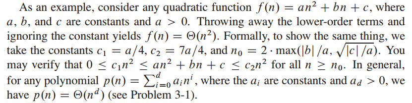
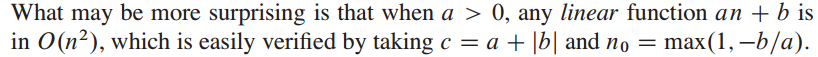

# ch3-question

## 3.1 Asymptotic notation 

### 3.1_1 question

Page 46, how to verify that? My solution is not graceful. And how them figure out the answer about the value of $c1,c2,n_0$?

### 3.1_2 question

### 3.1_2 answer

Need to prove $0\leq f(x) \leq c*g(x)$, for all $n \geq n_0$.

$an + b \geq 0 \Longrightarrow n \geq -\frac ba$

$an + b \leq (a + |b|) n^2 \Longrightarrow \frac an + \frac b{n^2} \leq a + |b|$

if $(n \geq 1) \land (b > 0)$, $\frac an + \frac b{n^2}  \leq a + b = a + |b|$, and if $(n \geq 1) \land (b \leq 0)$, $\frac an + \frac b{n^2}  \leq a \leq a + |b|$

